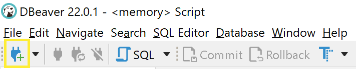
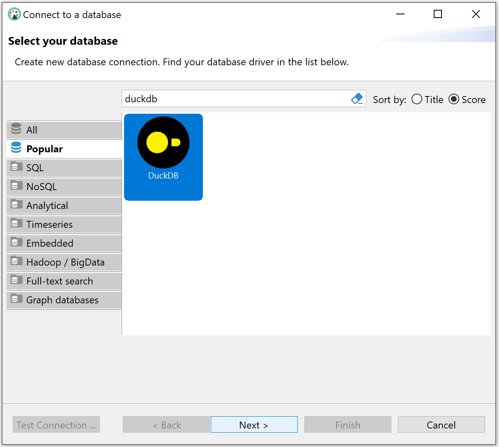

# 2.1 Windows OS
## 2.1.1 Powershell
simpley you can use cmd to download duckdb, just run the flowing command

```sh
winget install DuckDB.cli
```

## 2.1.2 Download
[Click here to download Windows DuckDB](https://github.com/duckdb/duckdb/releases/download/v1.0.0/duckdb_cli-windows-amd64.zip)
## 2.1.3 DBeaver driver
Also, you can just add Duckdb JDBC driver to query DuckDB.
1. Install DBeaver. [download page](https://dbeaver.io/download/)
2. Open DBeaver and create a new connection. Either click on the “New Database Connection” button or go to Database > New Database Connection in the menu bar.
   
   
   
   
3. Search for DuckDB, select it, and click Next.
   
4. 1


# 2.2 Linux OS


# 2.3 MAC OS


