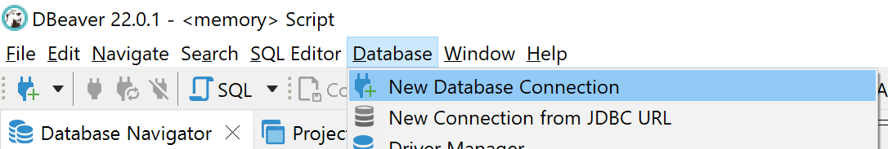
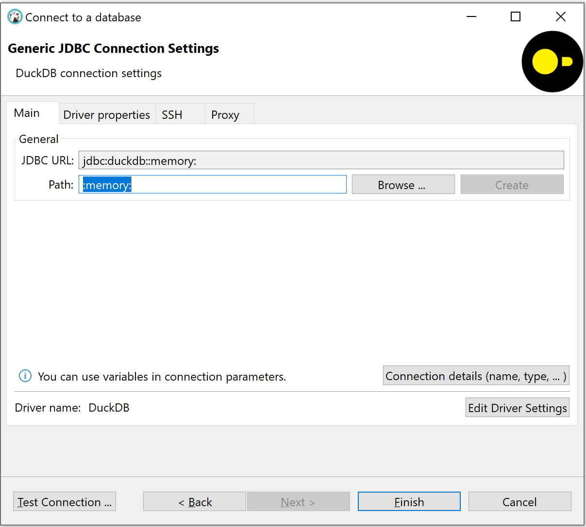
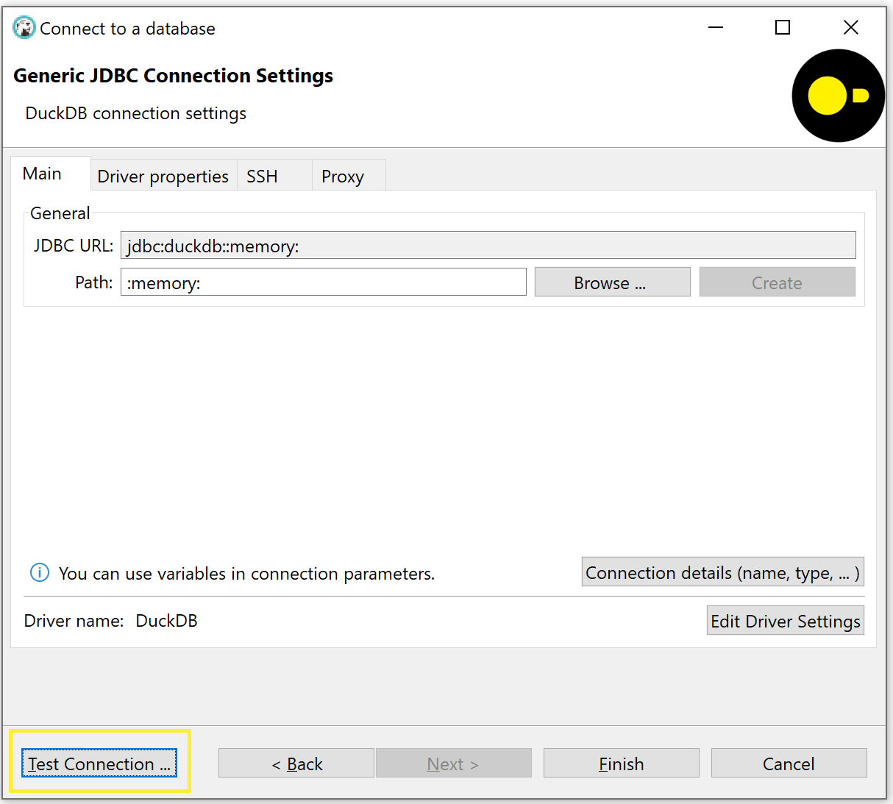
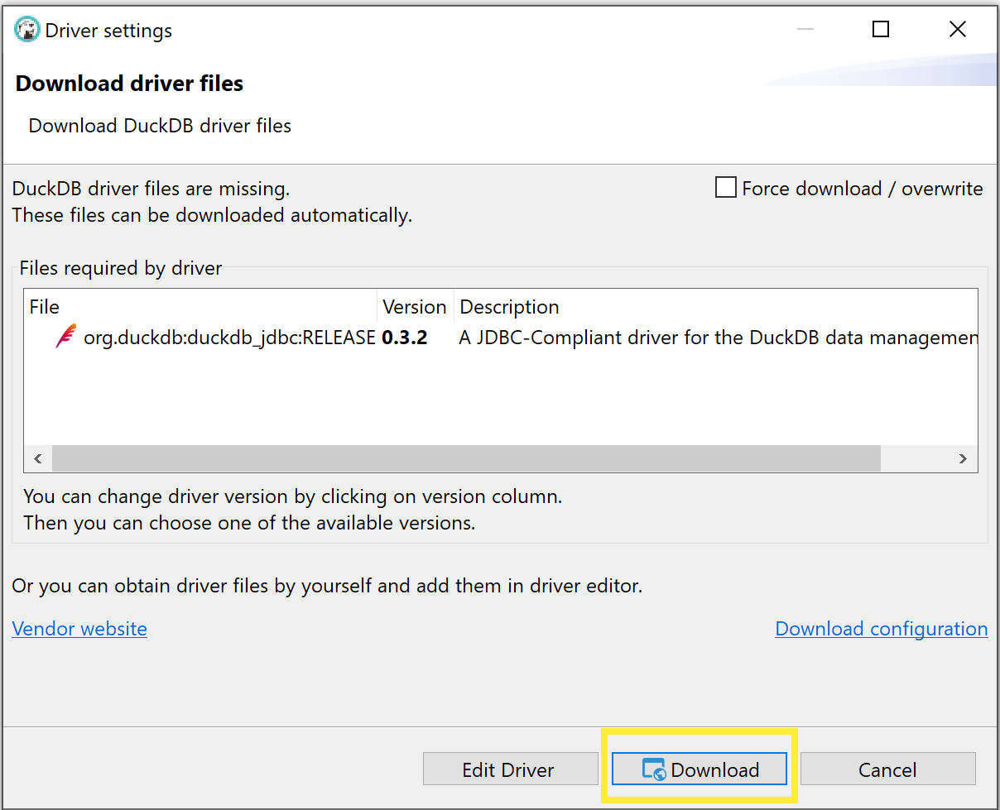
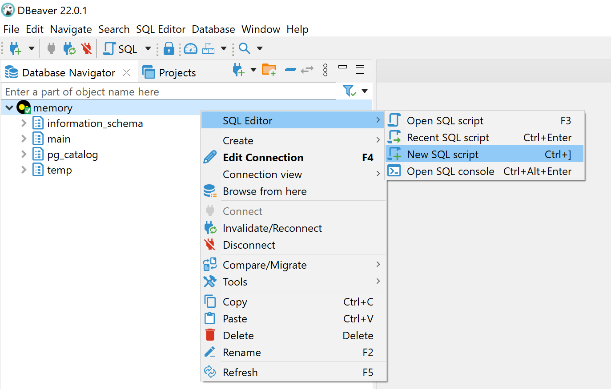
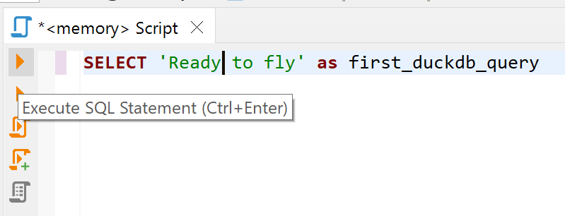
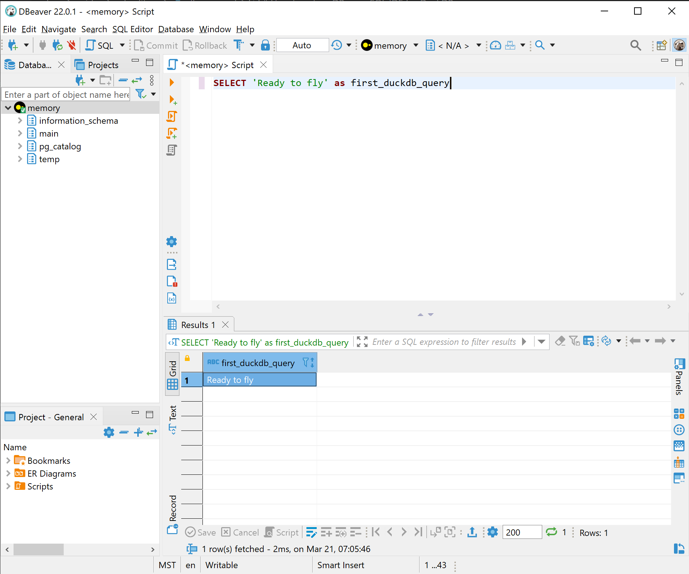

# 2.1 Windows OS
## 2.1.1 Powershell
simpley you can use cmd to download duckdb, just run the flowing command

```sh
winget install DuckDB.cli
```

## 2.1.2 Download
[Click here to download Windows DuckDB](https://github.com/duckdb/duckdb/releases/download/v1.0.0/duckdb_cli-windows-amd64.zip)
## 2.1.3 DBeaver driver
Also, you can just add Duckdb JDBC driver to query DuckDB.
1. Install DBeaver. [download page](https://dbeaver.io/download/)
2. Open DBeaver and create a new connection. Either click on the “New Database Connection” button or go to Database > New Database Connection in the menu bar.
   
   
   
   
3. Search for DuckDB, select it, and click Next.
   
   
4. Enter the path or browse to the DuckDB database file you wish to query. To use an in-memory DuckDB (useful primarily if just interested in querying Parquet files, or for testing) enter :memory: as the path.
   
   
5. Click “Test Connection”. This will then prompt you to install the DuckDB JDBC driver. If you are not prompted, see alternative driver installation instructions below.

   
6. Click “Download” to download DuckDB's JDBC driver from Maven. Once download is complete, click “OK”, then click “Finish”.

   **Note:** If you are in a corporate environment or behind a firewall, before clicking download, click the “Download Configuration” link to configure your proxy settings.

   
7. You should now see a database connection to your DuckDB database in the left hand “Database Navigator” pane. Expand it to see the tables and views in your database. Right click on that connection and create a new SQL script.

   
8. Write some SQL and click the “Execute” button.

   
9. Now you're ready to fly with DuckDB and DBeaver !

   

# 2.2 Linux OS


# 2.3 MAC OS


